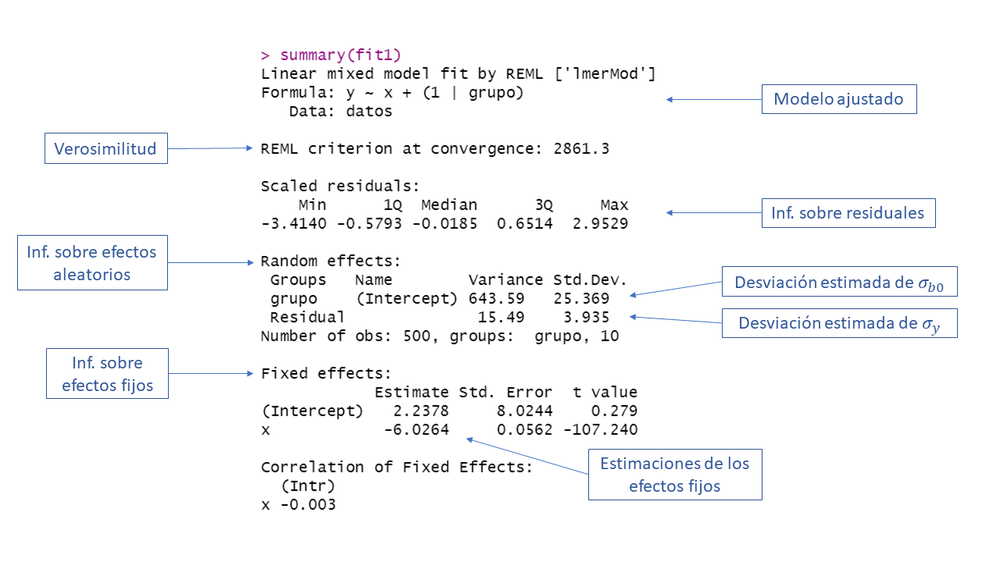

# Paquete **lme4** {#pac-lme4}

El paquete **lme4** [@R-lme4] es uno de los paquetes más completos para modelos mixtos. Al visitar este [enlace](https://cran.r-project.org/web/packages/lme4/) se encontrará la página de apoyo del paquete, allí se puede consultar el manual de referencia y las viñetas.

## Función `lmer`
La función `lmer` es la principal función del paquete [@R-lme4]. Esta función sirve para ajustar un modelo mixto y su estructura es la siguiente:

```{r, eval=FALSE}
lmer(formula, data = NULL, REML = TRUE, control = lmerControl(),
     start = NULL, verbose = 0L, subset, weights, na.action,
     offset, contrasts = NULL, devFunOnly = FALSE, ...)
```

Los principales argumentos de la función son:

- `formula`: es una fórmula similar a la usada en el modelo lineal clásico. Un ejemplo de fórmula sería `y ~ 1 + x1 + x2 + (1 + x2 | grupo)` con la cual se indican los efectos fijos y los efectos aleatorios del modelo. Más abajo hay una tabla con más detalles sobre la fórmula.
- `data`: marco de datos donde están las variables.  
- `REML`: valor lógico que sirve para indicar si queremos estimaciones maximizando la [verosimilitud restringida](https://en.wikipedia.org/wiki/Restricted_maximum_likelihood) o la verosimilitud usual.  

La siguiente imagen corresponde a la tabla 2 de la viñeta [Fitting Linear Mixed-Effects Models using lme4](https://cran.r-project.org/web/packages/lme4/vignettes/lmer.pdf). En esa tabla las dos primeras columnas muestran formas equivalentes de incluir las estructuras de modelos mixtos más comunes.

```{r echo=FALSE, out.width="90%", fig.align='center'}
knitr::include_graphics("images/tabla2_viñeta2_paq_lmer.png")
```

## Ejemplo: modelo normal con intercepto aleatorio {-}
En este ejemplo vamos a simular observaciones $n_i=50$ observaciones para $G=10$ grupos (en total 500 obs) que tengan la estructura mostrada abajo. El objetivo del ejemplo es ilustrar el uso de la función `lmer` para estimar los parámetros del modelo.

\begin{align*} 
y_{ij} &\sim  N(\mu_{ij}, \sigma^2_y) \\ 
\mu_{ij} &= 4 - 6 x_{ij} + b_{0i} \\
\sigma^2_y &= 16 \\
b_{0} &\sim N(0, \sigma^2_{b0}=625) \\
x_{ij} &\sim U(-5, 6)
\end{align*}

El vector de parámetros de este modelo es $\boldsymbol{\Theta}=(\beta_0=4, \beta_1=-6, \sigma_y=4, \sigma_{b0}=25)^\top$.

<div style="-moz-box-shadow: 1px 1px 3px 2px #000000;
  -webkit-box-shadow: 1px 1px 3px 2px #000000;
  box-shadow:         1px 1px 3px 2px #000000;">

```{block2, type='rmdexercise'}
Solución.
```

</div>

El código para simular las 500 observaciones se muestra a continuación. Observe que se fijó la semilla en dos ocasiones para que el lector pueda replicar el ejemplo y obtener los mismos resultados.

```{r, eval=TRUE, echo=TRUE}
ni <- 50
G <- 10
nobs <- ni * G
grupo <- factor(rep(x=1:G, each=ni))
obs <- rep(x=1:ni, times=G)
set.seed(1234567)
x <- runif(n=nobs, min=-5, max=6)
set.seed(1234567)
b0 <- rnorm(n=G, mean=0, sd=sqrt(625)) # Intercepto aleatorio
b0 <- rep(x=b0, each=ni)               # El mismo intercepto aleatorio pero repetido
media <- 4 - 6 * x + b0
set.seed(1234567)
y <- rnorm(n=nobs, mean=media, sd=sqrt(16))
datos <- data.frame(obs, grupo, b0, x, media, y)
```

Vamos a explorar los datos simulados.

```{r}
library(rmarkdown)
paged_table(datos, options = list(rows.print = 6))
```

El siguiente paso es dibujar los datos para explorar si sería apropiado usar un modelo con intercepto aleatorio (obvio porque así se simularon los datos). El código para dibujar los datos se muestra abajo.

```{r plot_simul_b0_lme4}
library(ggplot2)
ggplot(datos, aes(x, y, color=grupo) ) + 
  geom_point() + 
  labs(colour="Grupo/Cluster")
```

En la figura anterior se observa un patrón claro, todas las 10 nubes de puntos tienen la misma pendiente pero diferente intercepto con el eje vertical, eso se debe a que en la simulación se incluyó un $b_0$.

Para estimar los parámetros del modelos se usa la función `mler` de la siguiente forma.

```{r, message = FALSE, eval = TRUE, echo = TRUE}
library(lme4)
fit1 <- lmer(y ~ x + (1 | grupo), data = datos)
```

La función `summary` se puede usar sobre el objeto `fit1` para obtener una tabla de resumen, a continuación se ilustra el uso y la salida de `summary`.

```{r, eval=FALSE}
summary(fit1)
```

```{r echo=FALSE, out.width="110%", fig.align='center'}

```

Según el resultado anterior $\hat{\boldsymbol{\Theta}}=(\hat{\beta}_0=2.2378, \hat{\beta}_1=-6.0264, \hat{\sigma}_y=3.9352, \hat{\sigma}_{b0}=25.369)^\top$ mientras que el vector real de parámetros es $\boldsymbol{\Theta}=(\beta_0=4, \beta_1=-6, \sigma_y=4, \sigma_{b0}=25)^\top$.

<div style="-moz-box-shadow: 1px 1px 3px 2px #00ffff;
  -webkit-box-shadow: 1px 1px 3px 2px #00ffff;
  box-shadow:         1px 1px 3px 2px #00ffff;">

```{block2, type='rmdtip'}
Compare los resultados de la tabla anterior obtenida con la función `lmer` anterior con los resultados obtenidos con la función `lme` de capítulo \@ref(pac-nlme).

¿Hay alguna similitud?
```

</div>

## Ejemplo: recuperando los interceptos aleatorios {-}
¿Cómo se pueden obtener los interceptos aleatorios a partir del modelo ajustado en la sección anterior?

<div style="-moz-box-shadow: 1px 1px 3px 2px #000000;
  -webkit-box-shadow: 1px 1px 3px 2px #000000;
  box-shadow:         1px 1px 3px 2px #000000;">

```{block2, type='rmdexercise'}
Solución.
```

</div>

Para obtener los interceptos aleatorios se usa la función `ranef` del paquete **lme4** [@R-lme4]. A continuación vamos a obtener los interceptos aleatorios y los vamos a comparar con los $b_0$ simulados.

```{r}
interceptos_aleatorios <- ranef(fit1)
cbind(interceptos_aleatorios$grupo, b0=unique(b0))
```
De la salida anterior vemos que los $\tilde{b}_0$ son cercanos a los valores reales de $b_0$. 

<div style="-moz-box-shadow: 1px 1px 3px 2px #808080;
  -webkit-box-shadow: 1px 1px 3px 2px #808080;
  box-shadow:         1px 1px 3px 2px #808080;">

```{block2, type='rmdwarning'}
La comparación anterior solo es posible cuando usamos datos simulados. Cuando se usan datos de un fenómeno real no se tienen los valores de $b_0$.
```

</div>

## Función `glmer`
La función `glmer` es la función del paquete [@R-lme4] para ajustar modelo lineales generalizados mixtos y su estructura es la siguiente:

```{r, eval=FALSE}
lmer(formula, data = NULL, family = gaussian,
     control = glmerControl(),
     start = NULL, verbose = 0L, nAGQ = 1L,
     subset, weights, na.action, offset, contrasts = NULL,
     mustart, etastart, devFunOnly = FALSE)
```

Los principales argumentos de la función son:

- `formula`: es una fórmula similar a la usada en el modelo lineal clásico. Un ejemplo de fórmula sería `y ~ 1 + x1 + x2 + (1 + x2)` con la cual se indican los efectos fijos y los efectos aleatorios del modelo. Más abajo hay una tabla con más detalles sobre la fórmula.
- `data`: marco de datos donde están las variables.  
- `family`: argumento para seleccionar la distribución de la variable respuesta. Para más detalles de las distribuciones y funciones de enlace se recomienda ver la ayuda de la función `family` escribiendo esto en la consola `?family`. 

## Ejemplo: modelo gamma con intercepto aleatorio {-}
En este ejemplo vamos a simular observaciones $n_i=20$ observaciones para $G=10$ grupos (en total 200 obs) que tengan la estructura mostrada abajo. El objetivo del ejemplo es ilustrar el uso de la función `glmer` para estimar los parámetros del modelo.

\begin{align*} 
y_{ij} &\sim  Gamma(\mu_{ij}, \phi) \\ 
\log(\mu_{ij}) &= 2 - 8 x_{ij} + b_{0i} \\
\phi &= 0.5 \\
b_{0} &\sim N(0, \sigma^2_{b0}=9) \\
x_{ij} &\sim U(0, 1)
\end{align*}

El vector de parámetros de este modelo es $\boldsymbol{\Theta}=(\beta_0=2, \beta_1=-8, \phi=0.5, \sigma_{b0}=3)^\top$.

<div style="-moz-box-shadow: 1px 1px 3px 2px #000000;
  -webkit-box-shadow: 1px 1px 3px 2px #000000;
  box-shadow:         1px 1px 3px 2px #000000;">

```{block2, type='rmdexercise'}
Solución.
```

</div>

La función `rgamma_glm` que se muestra a continuación es una modificación de la función `rgamma` para tener la parametrización usada en los glm.

```{r}
rgamma_glm <- function(n, mu, phi) {
  x <- rgamma(n=n, shape=1/phi, scale=mu*phi)
  return(x)
}
```

A continuación el código para simular datos del modelo de interés.

```{r}
ni <- 20
G <- 10
nobs <- ni * G
grupo <- factor(rep(x=1:G, each=ni))
obs <- rep(x=1:ni, times=G)
set.seed(123456)
x <- runif(n=nobs, min=0, max=1)
set.seed(123456)
b0 <- rnorm(n=G, mean=0, sd=sqrt(9)) # Intercepto aleatorio
b0 <- rep(x=b0, each=ni)             # El mismo intercepto aleatorio pero repetido
media <- exp(2 - 8 * x + b0)
set.seed(123456)
y <- rgamma_glm(n=nobs, mu=media, phi=0.5)
datos <- data.frame(obs, grupo, b0, x, media, y)
```

Vamos a explorar los datos simulados.

```{r}
library(rmarkdown)
paged_table(datos, options = list(rows.print = 6, cols.print=6))
```

El siguiente paso es explorar los datos simulados. El código para dibujar los datos se muestra abajo.

```{r plot_simul_b0_gamma}
library(ggplot2)
ggplot(datos, aes(x, y, color=grupo) ) + 
  geom_point() + 
  labs(colour="Grupo/Cluster")
```

Para estimar los parámetros del modelos se usa la función `glmer` de la siguiente forma.

```{r, message = FALSE, eval = TRUE, echo = TRUE}
library(lme4)
fit2 <- glmer(y ~ x + (1 | grupo), family=Gamma(link="log"), data = datos)
```

La función `summary` se puede usar sobre el objeto `fit2` para obtener una tabla de resumen, a continuación se la salida de `summary`.

```{r}
summary(fit2)
```

Según el resultado anterior $\hat{\boldsymbol{\Theta}}=(\hat{\beta}_0=2.1641, \hat{\beta}_1=-8.0751, \hat{\phi}=0.4725, \hat{\sigma}_{bo}=3.9544)^\top$ mientras que el vector real de parámetros es $\boldsymbol{\Theta}=(\beta_0=2, \beta_1=-8, \phi=0.50, \sigma_{b0}=3)^\top$.


