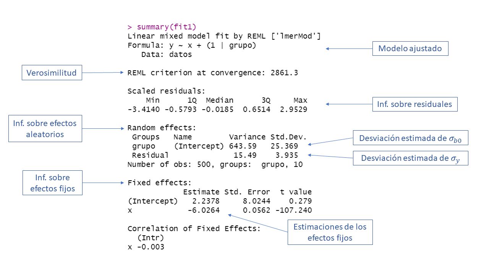

# Paquete **nlme** {#pac-nlme}

El paquete **nlme** [@R-nlme] es otro de los paquetes para modelos mixtos. Al visitar este [enlace](https://cran.r-project.org/web/packages/nlme) se encontrará la página de apoyo del paquete, allí se puede consultar el manual de referencia.

## Función `lme`
La función `lme` es la principal función del paquete [@R-nlme]. Esta función sirve para ajustar un modelo mixto y su estructura es la siguiente:

```{r, eval=FALSE}
lme(fixed, data, random, correlation, weights, subset, method,
    na.action, control, contrasts = NULL, keep.data = TRUE)
```

Los principales argumentos de la función son:

- `formula`: es una fórmula similar a la usada en el modelo lineal clásico. Un ejemplo de fórmula sería `y ~ 1 + x1 + x2 ` con la cual se indican los efectos fijos del modelo. 
- `data`: marco de datos donde están las variables. 
- `random`: es una fórmula solo con lado derecho. Si queremos indicar intercepto aleatorio se escribe `~ 1 | group` y si se desea intercepto y pendiente aleatoria se escribe `~ 1 + x2 | group`.
- `correlation`: es un parámetro opcional para indicar la estructura de correlación entre las observaciones de cada grupo. Para más detalles consulte la ayuda de la función `corClasses`.
- `method`: valor lógico que sirve para indicar si queremos estimaciones maximizando la [verosimilitud restringida](https://en.wikipedia.org/wiki/Restricted_maximum_likelihood) o la verosimilitud usual, las dos opciones son `ML` o `REML`.  

## Ejemplo: modelo con intercepto aleatorio {-}
En este ejemplo vamos a simular observaciones $ni=50$ observaciones para $G=10$ grupos (en total 500 obs) que tengan la estructura mostrada abajo. El objetivo del ejemplo es ilustrar el uso de la función `lmer` para estimar los parámetros del modelo.

\begin{align*} 
y_{ij} &\sim  N(\mu_{ij}, \sigma^2) \\ 
\mu_{ij} &= 4 - 6 x_{ij} + b_{0i} \\
\sigma^2_y &= 16 \\
b_{0} &\sim N(0, \sigma^2_{b0}=625) \\
x_{ij} &\sim U(-5, 6)
\end{align*}

El vector de parámetros de este modelo es $\boldsymbol{\Theta}=(\beta_0=4, \beta_1=-6, \sigma_y=4, \sigma_{bo}=25)^\top$.

__Solución__

El código para simular las 500 observaciones se muestra a continuación. Observe que se fijó la semilla en dos ocasiones para que el lector pueda replicar el ejemplo y obtener los mismos resultados.

```{r, eval=TRUE, echo=TRUE}
ni <- 50
G <- 10
nobs <- ni * G
grupo <- factor(rep(x=1:G, each=ni))
obs <- rep(x=1:ni, times=G)
set.seed(1234567)
x <- runif(n=nobs, min=-5, max=6)
b0 <- rnorm(n=G, mean=0, sd=sqrt(625)) # Intercepto aleatorio
b0 <- rep(x=b0, each=ni)  # El mismo intercepto aleatorio pero repetido
media <- 4 - 6 * x + b0
set.seed(123456)
y <- rnorm(n=nobs, mean=media, sd=sqrt(16))
datos <- data.frame(grupo, obs, b0, x, media, y)
```

El siguiente paso es dibujar los datos para explorar si sería apropiado usar un modelo con intercepto aleatorio (obvio porque así se simularon los datos). El código para dibujar los datos se muestra abajo.

```{r plot_simul_b0_nlme}
library(ggplot2)
ggplot(datos, aes(x, y, color=grupo) ) + 
  geom_point() + 
  labs(colour="Grupo/Cluster")
```

En la figura anterior se observa un patrón claro, todas las 10 nubes de puntos tienen la misma pendiente pero diferente intercepto con el eje vertical, eso se debe a que en la simulación se incluyó un $b_0$.

Para estimar los parámetros del modelos se usa la función `mler` de la siguiente forma.

```{r, message=FALSE}
library(nlme)
fit <- lme(y ~ x, random = ~ 1 | grupo, data=datos)
```

La función `summary` se puede usar sobre el objeto `fit` para obtener una tabla de resumen, a continuación se ilustra el uso y la salida de `summary`.

```{r, eval=FALSE}
summary(fit)
```

```{r echo=FALSE, out.width="110%", fig.align='center'}

```

Según el resultado anterior $\hat{\boldsymbol{\Theta}}=(\hat{\beta}_0=3.53363, \hat{\beta}_1=-5.97805, \hat{\sigma}_y=4.012, \hat{\sigma}_{bo}=21.507)^\top$ mientras que el vector real de parámetros es $\boldsymbol{\Theta}=(\beta_0=4, \beta_1=-6, \sigma_y=4, \sigma_{bo}=25)^\top$.
