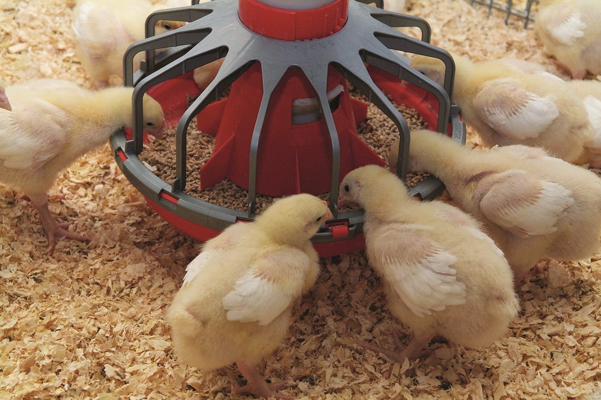

# Paquete **marginaleffects** {#marginals-effects}

En este capítulo se muestran algunas de las utilidades del paquete `marginaleffects` de @R-marginaleffects. Se le recomienda al lector visitar la [página oficial](https://vincentarelbundock.github.io/marginaleffects/) del paquete para ver más utilidades.

## Ejemplo ChickWeight lineal {-}
```{r echo=FALSE, out.width="50%", fig.align='center'}

```

En este ejemplo vamos a construir un modelo mixto para explicar el peso de unos pollitos en función de la edad y la dieta que recibieron (cuatro niveles). A continuación se muestra un diagrama de dispersión que relaciona el peso, la edad y la dieta.

```{r message=FALSE}
library(lme4)
library(tidyverse)
library(patchwork)
library(marginaleffects)
```

Para hacer el gráfico de dispersión.

```{r pairs-pollitos}
library(ggplot2)

ggplot(data = ChickWeight, aes(x = Time, y = weight, col=Diet)) +
  geom_point() +
  theme_bw() +
  facet_wrap(~ Chick) + 
  labs(y = "Weight (gr)", x = "Time (days)") + 
  theme(legend.position = "right")
```

De la figura anterior se observa claramente que a medida que aumenta el tiempo, el peso de cada pollito aumenta. Las trayectorias de la evolución del peso corporal parecen tener un patrón lineal o cuadrático del tiempo.

En este ejemplo vamos a ajustar un modelo con respuesta normal, efectos fijos debido al tiempo y a la dieta. Adicionalmente vamos a incluir un intercepto aleatorio para que la curva de crecimiento de cada pollito pueda comenzar a una altura diferente y una pendiente aleatoria para que el modelo tenga una pendiente de crecimiento diferente para cada pollito.

```{r message=FALSE}
fit1 <- lmer(
  weight ~ 1 + Time + Diet + (1 + Time | Chick),
  data = ChickWeight)
```

Vamos a explorar el modelo `fit1`, de él queremos conocer los valores de los efectos fijos del modelo, para eso vamos a usar el siguiente código:

```{r}
summary(fit1)
```

Ahora vamos a obtener los efectos aleatorios predichos. Para hacer esto podemos usar la instrucción `ranef(fit1)`, sin embargo eso nos generará una tabla con 50 filas y dos columnas (una para $\tilde{b}_0$ y otra para $\tilde{b}_1$). Por esa razón vamos a pedir solo los efectos aleatorios para los primeros 5 pollitos así:

```{r}
ranef(fit1)$Chick[1:5, ]
```

Usando la información de las salidas anteriores, vamos a predicir dos valores del peso para el pollito 13 que estuvo bajo la dieta 1. La primera predicción será en el pasado cuando $Time=19$ y la otra será para el futuro cuando $Time=22$. Para obtener estas dos predicciones debemos usar las estimaciones de los efectos fijos obtenidas con el `summary` y agregar los efectos aleatorios del pollito 13. Las operaciones para obtener las dos estimaciones se muestran a continuación.

\begin{align}
\widehat{Weight}_{13,19} &= 26.356 + 8.444 \times 19 + 19.811393 -6.321970 \times 19 \\
               &= 86.48596
\end{align}

\begin{align}
\widehat{Weight}_{13,22} &= 26.356 + 8.444 \times 22 + 19.811393 -6.321970 \times 22 \\
               &= 92.85205
\end{align}

Los resultados anteriores se pueden obtener automáticamente con la función `predictions()` de la siguiente manera.

```{r}
predictions(model=fit1,
            newdata = datagrid(Chick=13,
                               Diet=1,
                               Time=c(19, 22)))
```

En la columna Estimate de la salida anterior vemos que los valores coinciden con los obtenidos manualmente.

Ahora vamos a calcular los pesos estimados para todos los pollitos y luego vamos a dibujar las curvas crecimiento.

```{r plot_predict_pollitos_lineal}
pred1 <- predictions(model=fit1)

ggplot(pred1, aes(x=Time, y=estimate)) +
  geom_line() +
  theme_bw() +
  facet_wrap(~ Chick) +
  labs(y = "Predicted weight", 
       x = "Time", 
       title = "Linear growth model")
```

Para ver qué tan bien el modelo `fit1` logra predecir vamos a calcular la correlación entre $Weight$ y $\widehat{Weight}$ así:

```{r}
with(pred1, cor(weight, estimate))
```

De la salida anterior vemos que el valor de correlación es muy cercano a uno.

## Ejemplo ChickWeight cuadrático {-}
En este ejemplo vamos a repetir el modelo anterior pero incluyendo el tiempo como un polinomio de grado dos y la dieta. Los efectos aleatorios serán intercepto y pendiente aleatorias para tiempo solamente.

```{r}
fit2 <- lmer(
  weight ~ 1 + Time + I(Time^2) + Diet + 
    (1 + Time | Chick),
  data = ChickWeight)
```

Vamos a explorar el modelo `fit2`, de él queremos conocer los valores de los efectos fijos del modelo, para eso vamos a usar el siguiente código:

```{r}
summary(fit2)
```

Ahora vamos a obtener los efectos aleatorios predichos. Para hacer esto podemos usar la instrucción `ranef(fit2)`, sin embargo eso nos generará una tabla con 50 filas y dos columnas (una para $\tilde{b}_0$ y otra para $\tilde{b}_1$). Por esa razón vamos a pedir solo los efectos aleatorios para los primeros 5 pollitos así:

```{r}
ranef(fit2)$Chick[1:5, ]
```

Usando la información de las salidas anteriores, vamos a predicir dos valores del peso para el pollito 13 que estuvo bajo la dieta 1. La primera predicción será en el pasado cuando $Time=19$ y la otra será para el futuro cuando $Time=22$. Para obtener estas dos predicciones debemos usar las estimaciones de los efectos fijos obtenidas con el `summary` y agregar los efectos aleatorios del pollito 13. Las operaciones para obtener las dos estimaciones se muestran a continuación.

\begin{align}
\widehat{Weight}_{13,19} &= 34.79515 + 5.73911 \times 19 + 0.12960 \times 19^2 + 19.4103780 -6.35126669 \times 19^2 \\
               &= 89.36015
\end{align}

\begin{align}
\widehat{Weight}_{13,22} &= 34.79515 + 5.73911 \times 22 + 0.12960 \times 22^2 + 19.4103780 -6.35126669 \times 22^2 \\
               &= 103.4645
\end{align}

Los resultados anteriores se pueden obtener automáticamente con la función `predictions()` de la siguiente manera.

```{r}
predictions(model=fit2,
            newdata = datagrid(Chick=13,
                               Diet=1,
                               Time=c(19, 22)))
```

En la columna Estimate de la salida anterior vemos que los valores coinciden con los obtenidos manualmente.

Ahora vamos a calcular los pesos estimados para todos los pollitos y luego vamos a dibujar las curvas crecimiento.

```{r plot_predict_pollitos_cuadratico}
pred2 <- predictions(model=fit2)

ggplot(pred2, aes(x=Time, y=estimate)) +
  geom_line() +
  theme_bw() +
  facet_wrap(~ Chick) +
  labs(y = "Predicted weight", 
       x = "Time", 
       title = "Cuadratic growth model")
```

Para ver qué tan bien el modelo `fit2` logra predecir vamos a calcular la correlación entre $Weight$ y $\widehat{Weight}$ así:

```{r}
with(pred2, cor(weight, estimate))
```

De la salida anterior vemos que el valor de correlación es muy cercano a uno.

## Ejemplo

Predicciones para cada pollito pero diferenciando por la variable dieta:

```{r}
pred <- predictions(fit2)

ggplot(pred, aes(Time, estimate, level = Chick)) +
    geom_line() +
    ylab("Predicted Weight") +
    facet_wrap(~ Diet, labeller = label_both)
```

Para hacer predicciones a nivel de población podemos usar nuevamente la función `predictions()` pero sin indicar un pollito en particular. A continuación el código.

```{r}
pred <- predictions(model=fit2,
                    newdata = datagrid(Diet=1:4,
                                       Time=0:21))

ggplot(pred, aes(x = Time, y = estimate, ymin = conf.low, ymax = conf.high)) +
    geom_ribbon(alpha = .1, fill = "red") +
    geom_line() +
    facet_wrap(~ Diet, labeller = label_both) +
    labs(title = "Population-level trajectories")
```

Vamos a explorar los valores del objeto `pred` con el cual se hizo la figura anterior.

```{r}
pred
```


