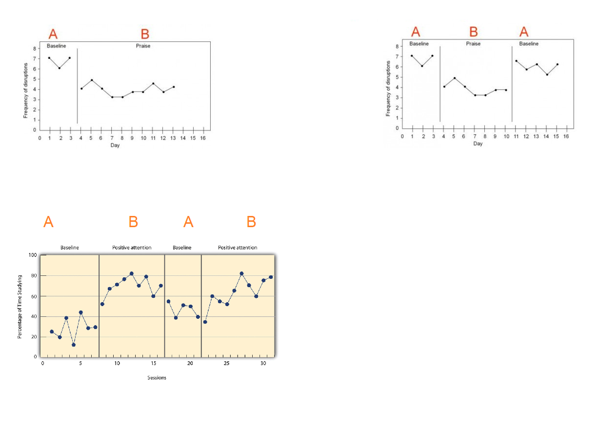

# Single case experimental desing (sced) {#sced}

Single-case experimental designs are a family of experimental designs that are characterized by researcher manipulation of an independent variable and repeated measurement of a dependent variable before (i.e., baseline) and after (i.e., intervention phase) introducing the independent variable. In single-case experimental designs a case is the unit of intervention and analysis (e.g., a child, a school). Because measurement within each case is conducted before and after manipulation of the independent variable, the case typically serves as its own control. Experimental variants of single-case designs provide a basis for determining a causal relation by replication of the intervention through (a) introducing and withdrawing the independent variable, (b) manipulating the independent variable across different phases, and (c) introducing the independent variable in a staggered fashion across different points in time. Due to their economy of resources, single-case designs may be useful during development activities and allow for rapid replication across studies. Taken from [this document](10.1093/OBO/9780199828340-0265).

Below we present some types of sced.

```{r echo=FALSE, out.width="220%", fig.align='center'}

```

## Ejemplo: simulación de un sced ABAB {-}

Crear una función para simular datos de un sced ABAB que tenga la estructura mostrada abajo y luego estime los parámetros del modelo.

\begin{align*}
y_{ij} | b_0 &\sim  N(\mu_{ij}, \sigma^2_y) \\
\mu_{ij} &= \beta_0 + \beta_1 session_{ij} + \beta_2 expB_{ij} + \beta_3 phase2_{ij} + \beta_4 \, expB_{ij} \, phase2_{ij} + b_{0i} \\
\sigma^2_y &= 1 \\
b_{0} &\sim N(0, \sigma^2_{b0}=1)
\end{align*}

Para que el experimento tenga un efecto significativo vamos a usar un valor grande $\beta_2=10$, los valores de los otros coeficientes deben ser los siguientes: $\beta_0=2$, $\beta_1=0$, $\beta_3=0$ y $\beta_4=0$. Estos últimos tres valores en cero significan que las variables experimento, phase y la interacción (experimento y phase) __NO__ serán significativas.

Simule datos para 9 sujetos cada uno con 10 observaciones en cada una de las cuatro fases ABAB.

<div style="-moz-box-shadow: 1px 1px 3px 2px #000000;
  -webkit-box-shadow: 1px 1px 3px 2px #000000;
  box-shadow:         1px 1px 3px 2px #000000;">

```{block2, type='rmdexercise'}
Solución.
```

</div>

Para simular datos del modelo ABAB con la estructura exigida podemos usar esta función.

```{r}
gen_dat <- function(n_subject=9, ni=10,
                    beta0=1, beta1=3, beta2=-3, 
                    beta3= -2, beta4=4,
                    sd_y=1, sd_b0=1) {
  nobs <- n_subject * ni * 4
  subject <- factor(rep(x=1:n_subject, each=ni * 4))
  session <- rep(x=1:(ni*4), times=n_subject)
  experiment <- rep(c("A", "B"), each=ni, times=n_subject)
  phase <- rep(1:2, each=ni*2, times=n_subject)
  phase <- as.factor(phase)
  b0 <- rnorm(n=n_subject, mean=0, sd=sd_b0) # Intercepto aleatorio
  b0 <- rep(x=b0, each=ni * 4)               # El mismo intercepto aleatorio pero repetido
  # Creando variables indicadoras para exp = B y phase = 2
  experiment_B <- experiment == "B"
  phase_2      <- phase == 2
  media <- beta0 + beta1 * session + beta2 * experiment_B +
    beta3 * phase_2 + beta4 * experiment_B * phase_2 + b0
  y <- rnorm(n=nobs, mean=media, sd=sd_y)
  datos <- data.frame(subject, session, experiment, phase, y)
  return(datos)
}
```

Vamos a simular los datos.

```{r}
set.seed(123456)
datos <- gen_dat(n_subject = 9, ni=10,
                 beta0=2, beta1=0, beta2=10,
                 beta3=0, beta4=0,
                 sd_y=1, sd_b0=1)
```

Exploremos los datos simulados.

```{r}
library(rmarkdown)
paged_table(datos)
```

Vamos a dibujar la evoluación de la variable respuesta $Y$ para ver si se refleja el efecto del experimento.

```{r sced01}
library(ggplot2)

ggplot(datos, aes(x = session, y = y)) +
  geom_point() + 
  geom_line() +
  facet_wrap(~subject) + 
  labs(x = "Session", y = "Outcome measure", color = "Phase") +
  ggtitle("Simulated ABAB experiment in a single-case design")
```

De la figura anterior se ve claramente que cuando el experimento es B, la variable $Y$ está en un mayor nivel, cuando el experimento es A, los valores de $Y$ disminuyen, esto sucede con todos los sujetos.

Ahora vamos a estimar los parámetros del modelo con lmee para ver si coinciden con los valores usados en la generación de los datos.

```{r message=FALSE}
library(lme4)
mod1 <- lmer(y ~ session + experiment * phase + (1|subject), 
           data = datos)

summary(mod1)
```

Vamos a repetir el ejercicio pero usando el paquete gamlss.

```{r message=FALSE}
library(gamlss)
mod2 <- gamlss(y ~ session + experiment * phase + re(random=~1|subject), data=datos)

summary(mod2)
```

A continuación el código para obtener las estimaciones de $\boldsymbol{\Theta}$ con `lmer` y `gamlss`.

```{r}
vc <- VarCorr(mod1)
vc <- as.data.frame(vc)

theta_lmer <- c(fixef(mod1), vc$sdcor[2:1])

theta_gamlss <- c(coef(mod2)[c(1, 2, 3, 4, 6)],
                  exp(coef(mod2, what='sigma')),
                  as.numeric(VarCorr(getSmo(mod2))[1, 2]))

theta_true <- c(beta0=2, beta1=0, beta2=10, beta3=0, beta4=0,
                sigma_y=1, sigma_b0=1)

cbind(theta_true, theta_lmer, theta_gamlss)
```

De la tabla anterior podemos ver que ambos enfoques lograron estimar bastante bien el vector de parámetros $\boldsymbol{\Theta}$. Para comparar vamos a calcular el [Mean Squared Error](https://en.wikipedia.org/wiki/Mean_squared_error).

```{r}
# MSE lmer
mean((theta_true - theta_lmer)^2)
# MSE gamlss
mean((theta_true - theta_gamlss)^2)
```

De los resultados vemos que el MSE de gamlss es ligeramente menor.
